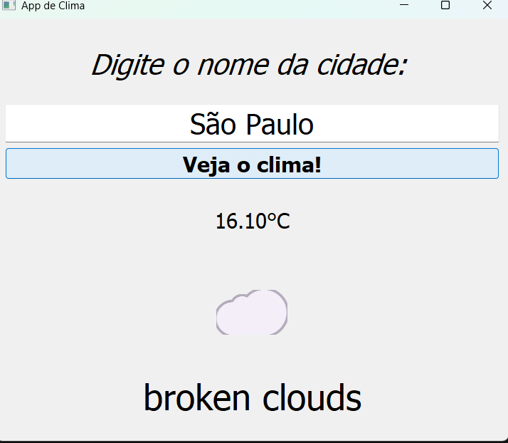

🌦️ Weather App with PyQt5 / App de Clima com PyQt5

A simple desktop application to check real-time weather conditions for any city. Um aplicativo de desktop simples para verificar as condições climáticas em tempo real para qualquer cidade.
📖 About / Sobre

English: This project is a desktop application developed in Python using the PyQt5 library for the graphical interface and Requests to consume the OpenWeatherMap API. It allows users to search for a city and view the temperature (converted from Kelvin to Celsius), a weather description, and a representative emoji.

Português: Este projeto é uma aplicação desktop desenvolvida em Python utilizando a biblioteca PyQt5 para a interface gráfica e Requests para consumir a API OpenWeatherMap. Ele permite que o usuário pesquise por uma cidade e veja a temperatura (convertida de Kelvin para Celsius), a descrição do clima e um emoji representativo.
✨ Features / Funcionalidades

English:

    🏙️ City Search: Query weather data for any city globally.

    🌡️ Temperature Conversion: Automatically converts API data from Kelvin to Celsius.

    🌤️ Dynamic UI: Displays specific emojis based on weather ID codes (Rain, Sun, Snow, etc.).

    🚫 Error Handling: robust handling for HTTP errors (404 City Not Found, Connection Errors).

Português:

    🏙️ Busca por Cidade: Consulte dados climáticos de qualquer cidade globalmente.

    🌡️ Conversão de Temperatura: Converte automaticamente os dados da API de Kelvin para Celsius.

    🌤️ Interface Dinâmica: Exibe emojis específicos baseados nos códigos de ID do clima (Chuva, Sol, Neve, etc.).

    🚫 Tratamento de Erros: Tratamento robusto para erros HTTP (404 Cidade Não Encontrada, Erros de Conexão).

🛠️ Technologies / Tecnologias

    Python 3.x

    PyQt5 (GUI Framework)

    Requests (HTTP Library)

    OpenWeatherMap API

🚀 How to Run / Como Rodar
1. Prerequisites / Pré-requisitos

English: Make sure you have Python installed. You will also need to install the required libraries. Português: Certifique-se de ter o Python instalado. Você também precisará instalar as bibliotecas necessárias.
Bash

pip install requests PyQt5

2. API Key Configuration / Configuração da API Key

English: You need an API Key from OpenWeatherMap. Open the script and replace the placeholder variable with your key: Português: Você precisa de uma Chave de API do OpenWeatherMap. Abra o script e substitua a variável placeholder pela sua chave:
Python

api_key = "YOUR_API_KEY_HERE"

3. Execution / Execução

English: Run the script in your terminal: Português: Rode o script no seu terminal:
Bash

python main.py

📸 Screenshots / Capturas de Tela

